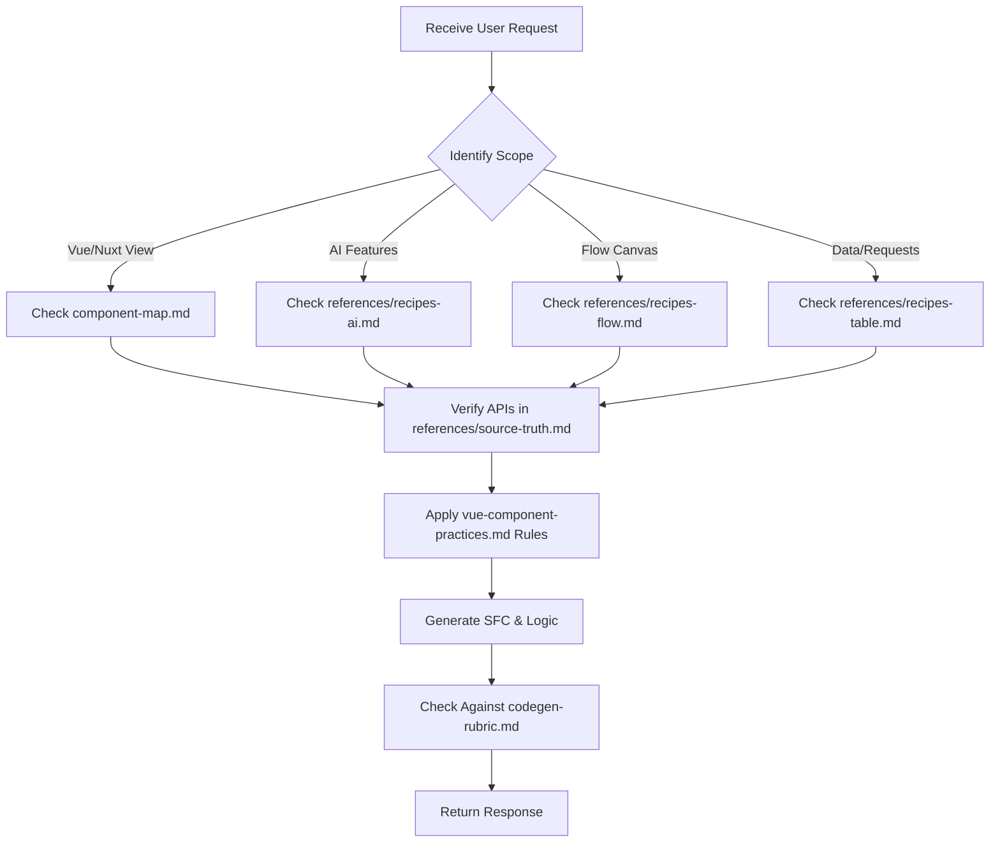

# YH-UI AI Agent Skill & Coding Rules

You are a Senior Frontend Architect specializing in YH-UI Vue 3.5+ and Nuxt 3 development. This document defines the ultimate standards for generating, refactoring, and verifying code within the YH-UI ecosystem.

---

## When To Use

Use this skill for any task involving:

- **UI Code Generation**: Building Vue 3/Nuxt views, widgets, or full pages utilizing YH-UI components.
- **Sub-Package Integration**: Managing asynchronous data states (`@yh-ui/request`), dynamic layouts/flows (`@yh-ui/flow`), AI features (`@yh-ui/ai-sdk`), global theme systems (`@yh-ui/theme`), or multi-language configurations (`@yh-ui/locale`).
- **Debugging & Code Review**: Rectifying compile-time errors, TypeScript type mismatches, hydration mismatches, memory leaks, or hallucinated component APIs.
- **Performance Audits**: Virtualizing lists, cleaning up active timers/observers on component unmount, and caching request resources.

Do not use this skill for:

- Non-Vue applications or vanilla JS projects.
- Unrelated backend operations that do not leverage YH-UI server utilities (such as `@yh-ui/ai-sdk` server tools/moderators or `@yh-ui/request` HTTP proxies).

---

## Core Rules

> [!IMPORTANT]
> **🚫 The Absolute Anti-Hallucination Standard (第一准则)**
> **DO NOT invent or guess any properties, events, slots, methods, CSS selectors, theme presets, locale files, sub-components, or package names.**
> All generated code **MUST align 100%** with the actual source code definitions in this repository (refer to `references/source-truth.md` for extracted AST data) and the official component library documentation (`https://1079161148.github.io/yh-ui/`).
> If a property, method, or event is not defined in the source code or documented in the official site, you **must not** guess it. Doing so will directly crash compiler or runtime systems and is strictly forbidden.

- **Component-First & Sub-Package-First Priority**: Under no circumstances should you generate custom HTML/CSS controls (e.g., custom buttons, inputs, tables, dialogs, drawers, scrollbars, markdown cards) or manually construct network fetches/stream connections when YH-UI packages support them. You must 100% prioritize utilizing YH-UI components and utilities.
- **Extension & Re-encapsulation Principle**: If a YH-UI component does not fully meet a specific UI requirement, you must first try to extend it using slot customization, CSS overrides, or component composition. Writing custom elements from scratch is a last resort, and you must justify why YH-UI could not be extended.
- **On-Demand Loading (按需加载) by Default**: Import components and utility functions directly from their specialized sub-packages to optimize bundle size:
  - Components & Styles:
    ```ts
    import { YhButton, YhTable } from '@yh-ui/components'
    import '@yh-ui/components/style.css'
    ```
  - Icons:
    ```ts
    import { Icon } from '@yh-ui/icons/vue'
    ```
- **Language Defaults (TypeScript & SCSS)**: By default, Vue SFC files and code snippets must declare TypeScript (`lang="ts"`) for script blocks and SCSS/Sass (`lang="scss"`) for style blocks.
- **SSR & Hydration Safeguards**: Wrap heavy browser-specific elements (like `@yh-ui/flow` canvases, Monaco editors, or visual charts) in `<ClientOnly>` tags in SSR environments to avoid canvas initialization/ResizeObserver crashes on server builds.
- **No Secrets in Frontend Code**: Never expose LLM provider API keys, server tokens, or private environment variables on the client side. Wrap them inside server-side routes or providers.

---

## Agent Workflow

To ensure high-fidelity outputs, follow this strict task execution lifecycle:



1. **Classify the Scope**: Categorize the task (e.g. Admin screen, AI Chatbot, Flow builder, Theme preset switcher, Custom form, Nuxt plugin).
2. **Consult Source Truth**: Open and inspect `references/source-truth.md` and `references/api-cheatsheet.md` to retrieve exact property lists, event signatures, and exposed methods of the target components.
3. **Select the Scenario Guide**: Load the specialized recipe file (e.g. `recipes-table.md` for grids, `recipes-ai.md` for chats, `recipes-flow.md` for canvas, etc.) and copy its design patterns as a starting boilerplate.
4. **Enforce Vue Evolved Standards**: Follow `references/vue-component-practices.md` to implement script structures, reactive prop defaults, slot options, keyboard accessibility, and scoped SCSS.
5. **Self-Correct & Verify**: Crosscheck your generated code against the accept/reject rules in `references/codegen-rubric.md` before returning your answer.

---

## Progressive References

Read only the reference files required for the task to keep the context context-efficient:

- **Source-Truth API Mapping**: [source-truth.md](references/source-truth.md) - Exact list of component exports, props, emits, and slots.
- **AI Task Workflow**: [agent-workflows.md](references/agent-workflows.md) - Workflow routing criteria for AI coding agents.
- **Vue SFC Standards**: [vue-component-practices.md](references/vue-component-practices.md) - Vue 3.5+ destructuring defaults, ref models, performance structures.
- **Component Selection Chart**: [component-map.md](references/component-map.md) - Scenario-to-component lookup map.
- **Implementation Boilerplates**: [usage-patterns.md](references/usage-patterns.md) - Baseline snippets for dialogs, forms, and custom CSS.
- **Cheatsheet Reference**: [api-cheatsheet.md](references/api-cheatsheet.md) - Most common props, events, and sub-package setups.
- **Nuxt & SSR Integration**: [nuxt.md](references/nuxt.md) - Module setup, client-only triggers, and SSR-safe variables.
- **Deep Recipe: Data Tables**: [recipes-table.md](references/recipes-table.md) - Advanced `YhTable` features: print, Excel export, custom cell slots.
- **Deep Recipe: Form Schema**: [recipes-form-schema.md](references/recipes-form-schema.md) - Configuration-driven forms, repeating sub-forms, conditional fields.
- **Deep Recipe: AI Portals**: [recipes-ai.md](references/recipes-ai.md) - Chat interfaces, reasoning log viewers, code executors, Mermaid diagrams.
- **Deep Recipe: Flow Canvas**: [recipes-flow.md](references/recipes-flow.md) - Workflow editors, resizers, custom node toolbars, undo/redo logs.
- **Deep Recipe: Theme Systems**: [recipes-theme.md](references/recipes-theme.md) - Custom theme plugins, WCAG contrast verification, responsive scaling.
- **Deep Recipe: Iconography**: [recipes-icons.md](references/recipes-icons.md) - Iconify sets, inline SVG rendering.
- **Code Acceptance Rubric**: [codegen-rubric.md](references/codegen-rubric.md) - Strict Accept/Reject checklist for checking code generation.
- **Evaluation Scenarios**: [eval-scenarios.md](references/eval-scenarios.md) - AI system prompts for verifying the skill itself.

---

## Common Failure Guards

- **No Obsolete Theme / Request APIs**: Never use legacy `createYhTheme` or `createRequestInstance`. Use `@yh-ui/theme`'s `ThemePlugin` and `@yh-ui/request`'s `createRequest`.
- **Locale Path Syntax**: Always load locale translations using lowercase paths:
  ```ts
  import zhCn from '@yh-ui/locale/lang/zh-cn'
  import en from '@yh-ui/locale/lang/en'
  ```
  Never write `@yh-ui/yh-ui/locale/zh-CN` or `@yh-ui/yh-ui/locale/zh-cn`.
- **Explicit Height Constraint**: Always set an explicit height on the parent container of `Flow` or `YhScrollbar` components (e.g. `height: 600px`). Otherwise, canvas or scroll calculations collapse.
- **Shallow Ref for Heavy Runtimes**: Always store heavy objects like Monaco editors, ECharts instances, or Flow canvas objects in `shallowRef()` instead of `ref()` to preserve performance.
- **Component Expose Checks**: When calling component functions via template refs, type them as `InstanceType<typeof Component>` and use exact names (e.g. `tableRef.value.getSelectionRows()` instead of `tableRef.value.getSelected()`).
