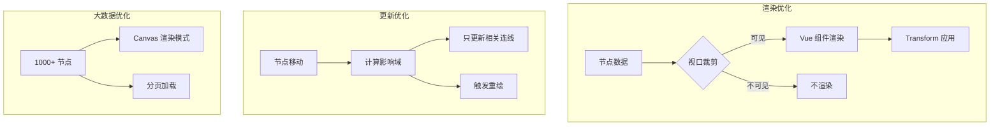

## 架构设计

### 核心技术选型

- **渲染层**: 混合架构
  - 节点层: Vue 组件 + CSS Transform（支持复杂交互）
  - 连线层: SVG（易于交互和动画）
  - 背景/网格: Canvas（极致性能）
  - 大节点群: Canvas 渲染（1000+ 节点时）
- **状态管理**: Pinia（@yh-ui/store）或 Vue Reactivity API
- **虚拟滚动**: 自研视口裁剪算法，只渲染可见节点
- **插件系统**: 统一插件接口 + 事件总线

### 目录结构

```
packages/components/src/flow/
├── src/
│   ├── core/                    # 核心引擎
│   │   ├── FlowContext.ts       # 上下文 provider
│   │   ├── useFlow.ts          # 核心 composable
│   │   ├── useViewport.ts      # 视口管理（缩放/平移）
│   │   ├── useNodes.ts          # 节点状态管理
│   │   ├── useEdges.ts         # 连线状态管理
│   │   ├── useSelection.ts     # 选区管理
│   │   ├── useHistory.ts       # 撤销/重做
│   │   └── useKeyboard.ts      # 键盘快捷键
│   ├── renderer/                # 渲染层
│   │   ├── FlowRenderer.vue    # 主渲染器
│   │   ├── NodeRenderer.vue    # 节点渲染
│   │   ├── EdgeRenderer.vue    # 连线渲染
│   │   ├── Background.vue      # 背景（Canvas）
│   │   ├── Minimap.vue         # 小地图
│   │   └── SelectionBox.vue    # 框选
│   ├── components/              # 内置组件
│   │   ├── nodes/              # 内置节点类型
│   │   │   ├── BaseNode.vue
│   │   │   ├── InputNode.vue
│   │   │   ├── OutputNode.vue
│   │   │   ├── GroupNode.vue
│   │   │   └── CustomNode.vue
│   │   └── edges/              # 内置连线类型
│   │       ├── BaseEdge.vue
│   │       ├── SmoothEdge.vue
│   │       ├── StepEdge.vue
│   │       └── BezierEdge.vue
│   ├── plugins/                 # 插件系统
│   │   ├── plugin.ts           # 插件接口
│   │   ├── plugins/            # 内置插件
│   │   │   ├── minimap/        # 小地图插件
│   │   │   ├── controls/       # 控制栏插件
│   │   │   ├── grid/           # 网格对齐插件
│   │   │   ├── snap/           # 吸附插件
│   │   │   ├── keyboard/      # 快捷键插件
│   │   │   ├── export/         # 导出插件
│   │   │   ├── layout/         # 自动布局插件
│   │   │   └── validation/     # 连线校验插件
│   │   └── index.ts
│   ├── utils/                   # 工具函数
│   │   ├── graph.ts            # 图算法（最短路径、环检测）
│   │   ├── geometry.ts        # 几何计算
│   │   ├── transform.ts        # 坐标转换
│   │   └── edge.ts             # 连线路径生成
│   └── types/                   # 类型定义
│       ├── node.ts
│       ├── edge.ts
│       ├── viewport.ts
│       ├── events.ts
│       └── plugin.ts
├── index.ts                      # 导出入口
└── package.json
```

## 功能模块

### 1. 核心引擎（优先级：高）

- [x] 节点管理：增删改查、批量操作
- [x] 连线管理：连接、断连、类型切换
- [x] 视口控制：缩放、平移、fitView、center
- [x] 坐标转换：屏幕↔画布坐标

### 2. 交互系统（优先级：高）

- [x] 节点拖拽（支持多个节点）
- [x] 连线拖拽（创建新连接）
- [x] 选区框选
- [x] Shift 多选
- [x] 键盘快捷键（Delete, Ctrl+Z, Ctrl+C/V 等）

### 3. 连线系统（优先级：高）

- [x] 锚点系统（4方向/8方向/自动）
- [x] 连线类型：直线、贝塞尔曲线、阶梯线
- [x] 动画连线
- [x] 连线标签
- [x] 连线校验（可配置连接规则）

### 4. 对齐系统（优先级：中）

- [x] 网格对齐
- [x] 节点对齐线
- [x] 自动对齐/吸附
- [x] 节点分布（水平/垂直）

### 5. 插件系统（优先级：中）

- [x] 插件接口标准化
- [x] 内置插件：Minimap, Controls, Grid, Snap, Export
- [x] 自定义插件扩展点

### 6. 性能优化（优先级：高）

- [x] 虚拟滚动：只渲染视口内节点 ± 缓冲区
- [x] 增量更新：节点移动只更新相关连线
- [x] Memo 化：防止不必要的重渲染
- [ ] Web Worker：布局计算（可选）

### 7. 扩展能力（优先级：中）

- [x] 自定义节点（组件方式）
- [x] 自定义连线
- [x] 自定义样式
- [x] 节点嵌套（Group）

## 关键性能策略



## 实现计划

### Phase 1: 基础框架（1周）

- [x] 项目结构搭建（`packages/flow/src`）
- [x] 核心类型定义（`packages/flow/src/types`）
- [x] FlowContext 和 useFlow（`packages/flow/src/core/FlowContext.ts` / `packages/flow/src/core/useFlow.ts`）
- [x] 基础渲染器（节点 + 连线）（`packages/flow/src/renderer/*`）
- [x] 视口缩放平移（`packages/flow/src/core/useViewport.ts`）

### Phase 2: 交互系统（1周）

- [x] 节点拖拽（`NodeRenderer` + `useNodes`）
- [x] 连线创建/删除（连接拖拽创建 + `useEdges.removeEdge`）
- [x] 选区单选/多选（`useSelection` + Shift 多选）
- [x] 键盘快捷键（`useKeyboard`：Delete / Undo / Redo / Escape / SelectAll）

### Phase 3: 连线系统（1周）

- [x] 锚点系统（handles：Position + handleBounds）
- [x] 多种连线类型（`utils/edge.ts`：straight / bezier / step / smoothstep）
- [x] 连线动画（`Edge` animated + SVG dash）
- [x] 连线校验（`utils/validation.ts` + connectionValidator + cycle detect）

### Phase 4: 增强功能（1周）

- [x] 网格/对齐（snapToGrid + `useAlignment`）
- [x] 撤销/重做（`useHistory`）
- [~] 插件系统基础（类型/PluginManager 已有，但 `Flow.vue` 尚未真正接入 usePlugin/removePlugin）
- [x] Minimap / Controls（renderer 组件 + Flow props 开关）

### Phase 5: 性能优化（1周）

- [x] 虚拟滚动（`Flow.vue` visibleNodes 裁剪）
- [~] 增量更新（节点移动只更新相关连线：基础能力具备，仍可做更精细的影响域计算）
- [~] Memo 化（需要继续用 computed/浅比较减少不必要渲染，当前为基础实现）
- [ ] 10000 节点测试（待补：benchmark 页面 + 数据集 + 指标）

### Phase 6: 扩展与文档（1周）

- [x] 自定义节点/连线示例（已提供内置节点/边；文档示例持续补齐中）
- [~] 完整 API 文档（已新增 flow 章节骨架，仍需补全细节与自动生成）
- [ ] 单元测试（待补：core/utils/history/validation/transform）

## 超越 vue-flow 的关键点

| 维度 | vue-flow 现状 | 我们的优势 |

|------|---------------|------------|

| 性能 | 1000+ 节点有压力 | 虚拟滚动 + Canvas 混合，10000+ 节点 |

| 架构 | 单体 | 模块化 + 插件系统 |

| 扩展 | 组件覆盖 | 深度扩展点（生命周期、渲染阶段） |

| 类型 | 基础类型 | 完整类型 + 泛型支持 |

| AI 场景 | 无 | 内置 AI 节点组件 |

| BPMN | 需插件 | 预留扩展点 |

## 风险与对策

1. **风险**: 虚拟滚动实现复杂度高
   - **对策**: 先实现基础版，再迭代优化

2. **风险**: 10000 节点性能
   - **对策**: Canvas 回退方案 + 分页加载

3. **风险**: 插件系统设计
   - **对策**: 借鉴 vscode 插件机制，简单可靠
